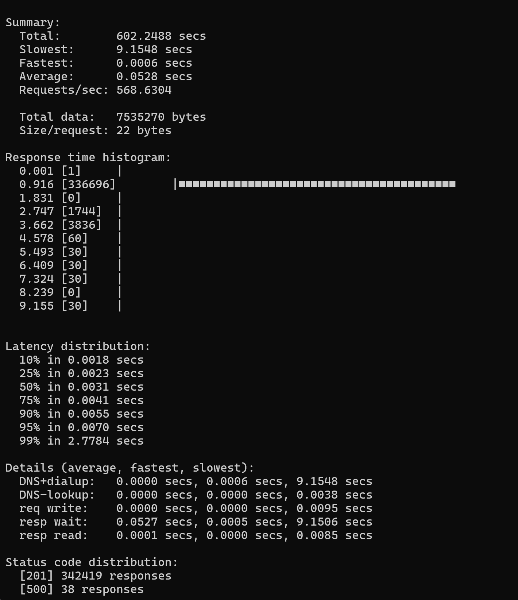
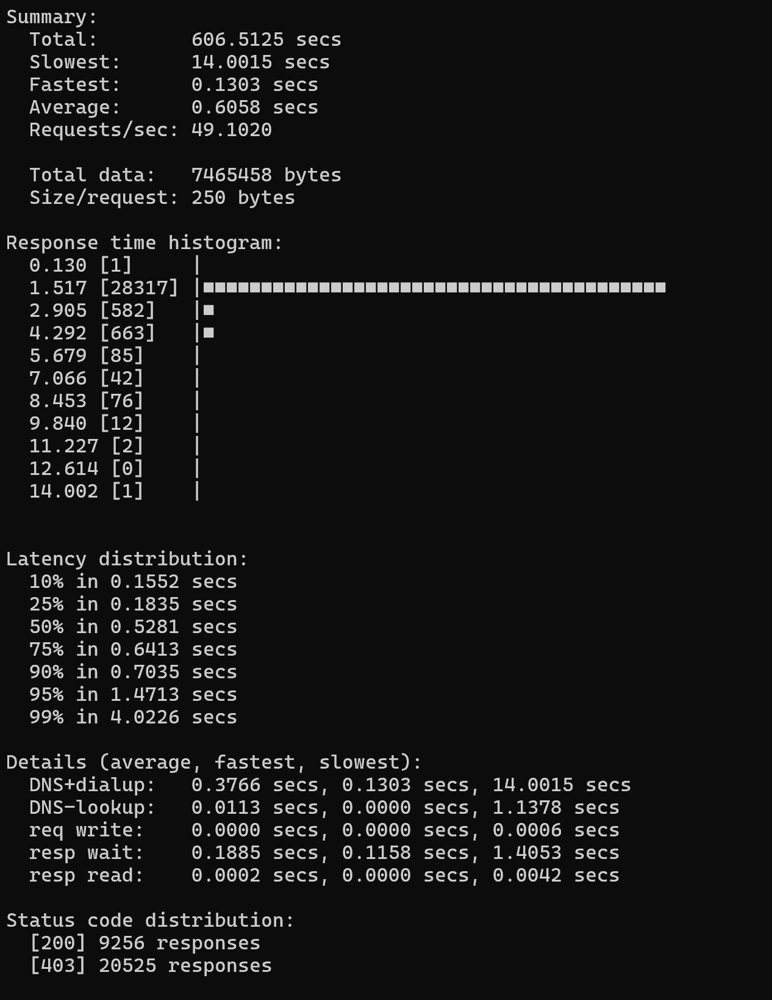

## Запуск
#### Убедитесь, что Docker запущен, затем соберите и запустите сервис:
```bash
docker compose up --build --scale shortener={number of containers}
```
После запуска:
- Сервис будет доступен на http://localhost

#### Сервер работает по адресу https://url-shortener-1cjv.onrender.com

## Тесты
Тесты находятся в папке [test](url-shortener/test/) \
Запуск:
```bash
make e2e
```

## Нагрузочное тестирование
Тестирование проводилось с помощью `hey` при следующих условиях:
- 1 контейнер 
- 30 параллельных соединений
- 10 минут нагрузки

#### 1. Создание короткой ссылки
```bash
POST /shorten
```
<div>
  
</div>

#### 2. Редирект по короткому коду
```bash
GET /{code}
```
<div>
  
</div>

## Линтер
В проекте используется `golangci-lint` для статического анализа кода. \
Конфигурация: [.golangci.yml](url-shortener/.golangci.yml).\
Использовать можно через: [lint.go](url-shortener/lint.go) \
Запуск:
```bash
make lint
```

## Переменные окружения
Находятся в [.env](url-shortener/.env)
```
# Logger
ENV=debug

# Server
SERVER_HOST=localhost
SERVER_ADDR=:8080
SERVER_TIMEOUT_SECONDS=60
SERVER_IDLE_TIMEOUT_SECONDS=4
SERVER_MAX_CONN=1

# Databse
DB_TYPE=redis
DB_URL=redis://:sdnsfnsdnsgqerqew234whdnd@redis:6379

# URL Shortener
URL_TTL=60m
URL_LENGTH=10
URL_SALT=6gdpqq9chviajjkflnvGVHjklmlkva7
```